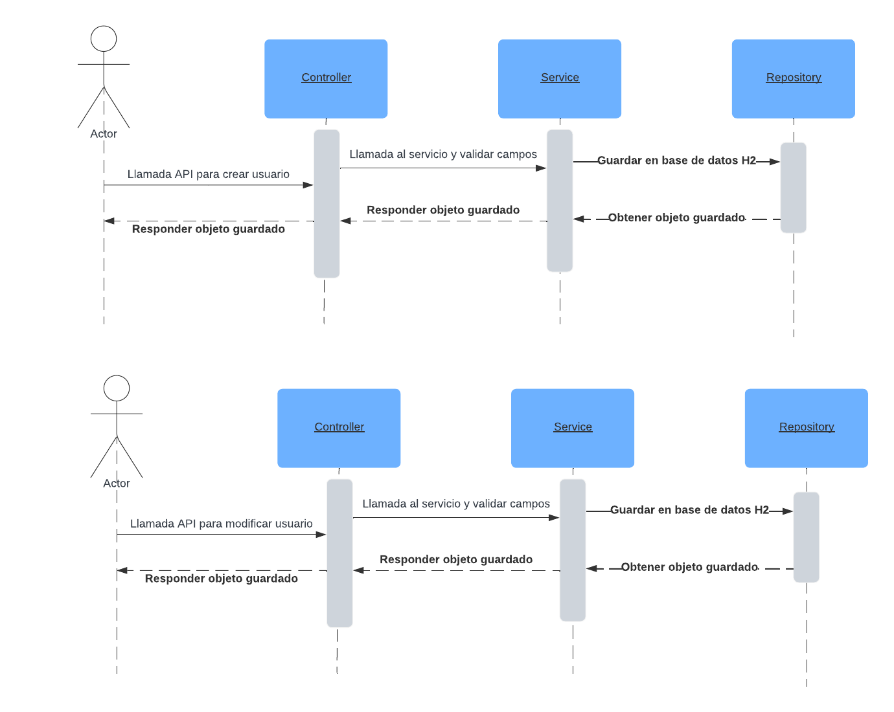
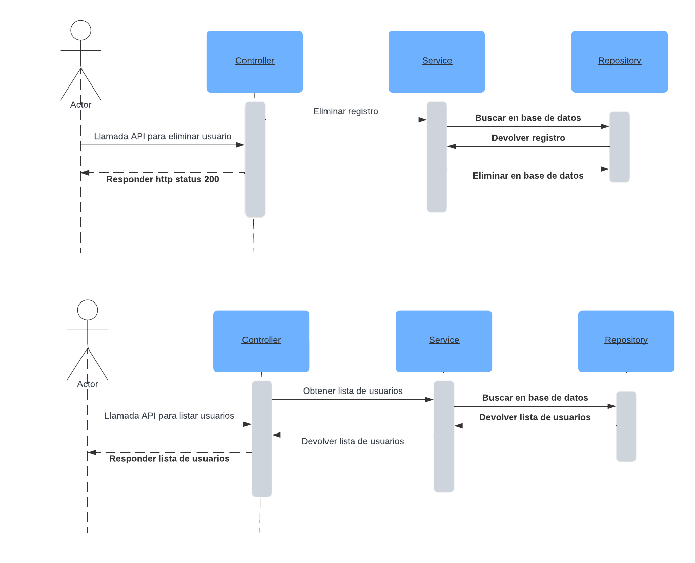

# Demo project
## Stack
- Java 17
- H2
## Ejecutando el proyecto

### Clonando el proyecto
```shell
git clone https://github.com/majitospost/Demo-nisum.git
```
### Instalando dependencias
```shell
./gradlew build
```
### Ejecutando el proyecto
```shell
./gradlew bootRun
```
> [!NOTE]
> No es necesario crear la base de datos, esta se creará automáticamente cuando se ejecute el programa.
## APIs

### Creando usuario
```shell
curl --request POST \
  --url http://localhost:8080/api/users \
  --header 'Content-Type: application/json' \
  --data '{
	"name": "Juan Rodriguez",
	"email": "juan@rodriguez.org",
	"password": "hunter2",
	"phones": [
		{
			"number": "1234567",
			"cityCode": "1",
			"countryCode": "57"
		}
	]
}'
```
### Modificando usuario
```shell
curl --request PUT \
  --url http://localhost:8080/api/users \
  --header 'Content-Type: application/json' \
  --data '{
	"id": "{{userId}}",
	"name": "Modificado",
	"email": "modificado@mail.org",
	"password": "password123",
	"phones": [
		{
			"id": 2,
			"number": "56789",
			"cityCode": "34",
			"countryCode": "789"
		}
	]
}'
```
### Listando usuarios
```shell
curl --request GET \
  --url http://localhost:8080/api/users
```

### Eliminando usuario
```shell
curl --request DELETE \
  --url http://localhost:8080/api/users/{{userId}}
```

# Pruebas unitarias
Hay dos archivos de pruebas, uno para el servicio y otro para el controlador.
```shell
./gradlew clean
./gradlew test
```

# Diagramas de la solución




# Open API (Swagger)
Abrir el siguiente [enlace](http://localhost:8080/api/swagger-ui/index.html) para ver la UI de Swagger.
